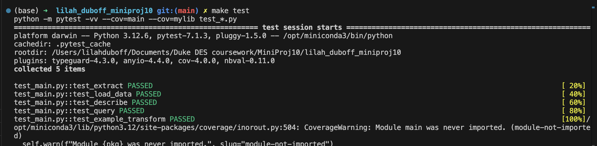

# Mini Project 10: PySpark Data Processing
---
##### The purpose of this project is to utilize PySpark to complete a data analysis on a large dataset (100+ rows). The data utilized in this project is a column-wise subset of a free Kaggle dataset. The csv includes information on demographics of employees in a variety of industries, the number of hours they work per week, whether their work is hybrid or remote, and whether or not they experience symptoms of mental illness. 
---
### Structure for this Project
---
- .devcontainer
    - devcontainer.json
    - Dockerfile
- .github
    - cicd.yml
- data
    - table_1_remote_work_mental_health.csv
- mylib
    - lib.py
- Dockerfile
- License
- main.py
- Makefile
- passing_tests.png
- pyspark_output.md (generated markdown file)
- README.md
- repeat.sh
- requirements.txt
- setup.sh
- test_main.py

