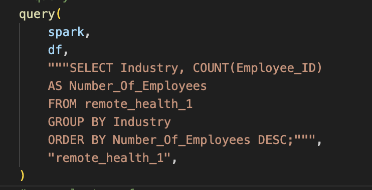
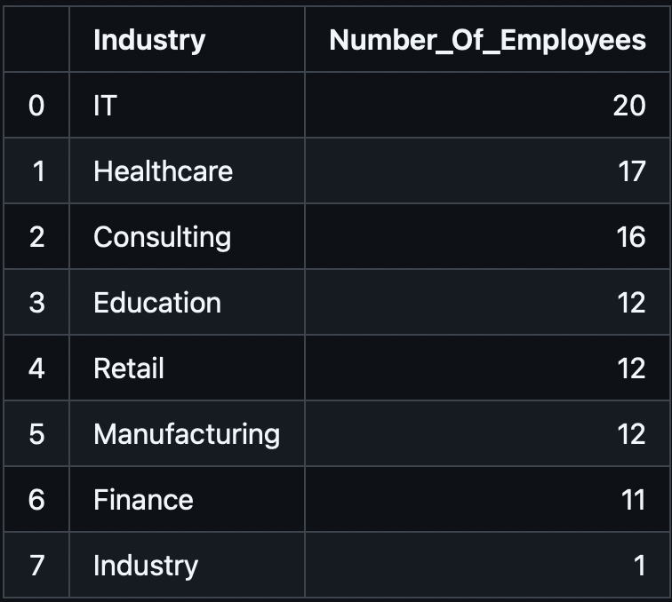

# Mini Project 10: PySpark Data Processing
---
##### The purpose of this project is to utilize PySpark to complete a data analysis on a large dataset (100+ rows). The data utilized in this project is a column-wise subset of a free Kaggle dataset. The csv includes information on demographics of employees in a variety of industries, the number of hours they work per week, whether their work is hybrid or remote, and whether or not they experience symptoms of mental illness. 
---
### Structure for this Project
---
- .devcontainer
    - devcontainer.json
    - Dockerfile
- .github
    - cicd.yml
- data
    - table_1_remote_work_mental_health.csv
- mylib
    - lib.py
- Dockerfile
- License
- main.py
- Makefile
- passing_tests.png
- pyspark_output.md (generated markdown file)
- README.md
- repeat.sh
- requirements.txt
- setup.sh
- test_main.py
---
### Functions to Analyze the Data
##### Similar to the Python and Rust projects, we use PySpark to create an ETL pipeline to Extract, Transform, and Load the data into a data folder within the repository. First, the data is loaded from a URL to a filepath, and stored in the designated repo folder. Then, the contents of the file are loaded into the table. Finally, a transform is applied to further categorize the data by work location. 

##### Next, the describe function performs the pandas .describe method to generate summary statistics from the dataset. As some of it is numerical and some is categorical, there are sections of the table that are purposefully blank. In particular, we are able to get the mean, standard deviation, min, and max of the employees' age, number of years of experience, the number of hours they worked per week, the number of virtual meetings per week, and how they would rate their work-life balance.

|    | summary   | Employee_ID   |      Age | Gender            | Job_Role          | Industry   |   Years_of_Experience | Work_Location   |   Hours_Worked_Per_Week |   Number_of_Virtual_Meetings |   Work_Life_Balance_Rating |
|---:|:----------|:--------------|---------:|:------------------|:------------------|:-----------|----------------------:|:----------------|------------------------:|-----------------------------:|---------------------------:|
|  0 | count     | 101           | 100      | 101               | 101               | 101        |              100      | 101             |                100      |                    100       |                  100       |
|  1 | mean      |               |  40.85   |                   |                   |            |               18.46   |                 |                 39.12   |                      8.44    |                    3.02    |
|  2 | stddev    |               |  12.1459 |                   |                   |            |               10.0689 |                 |                 12.3822 |                      4.40917 |                    1.30252 |
|  3 | min       | EMP0001       |  22      | Female            | Data Scientist    | Consulting |                1      | Hybrid          |                 20      |                      0       |                    1       |
|  4 | max       | Employee_ID   |  60      | Prefer not to say | Software Engineer | Retail     |               35      | Work_Location   |                 60      |                     15       |                    5       |

##### Finally, the query function can performa any query that is put into the main file.

##### In this project, the query I ran can be seen in the main.py file, or in the screenshot below. The goal of the query was to find the count of employees based on the industry they worked in. First, I selected all of the Employee ID data from the Remote Health table, and grouped them by Industry to get the count. Then, I placed it in descending order, as seen in the Table output below. This rearranges the data to show the industry with the highest number of employees in the top row. 

#### Main Query Code

#### Table 1: Sample Query Output

